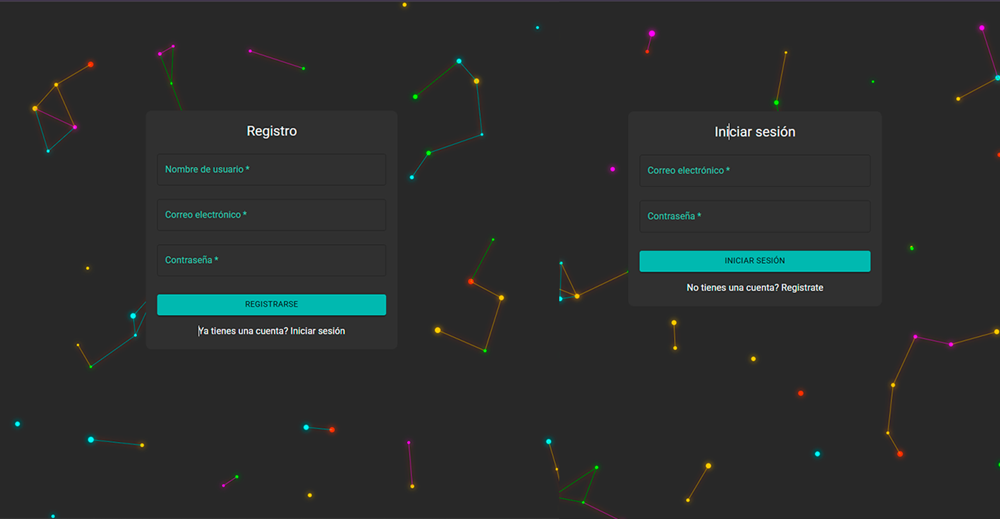
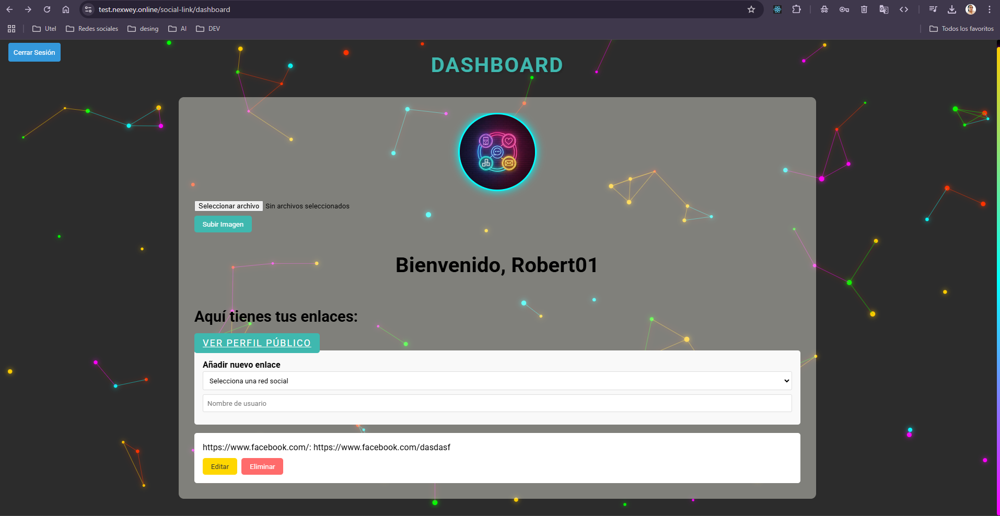
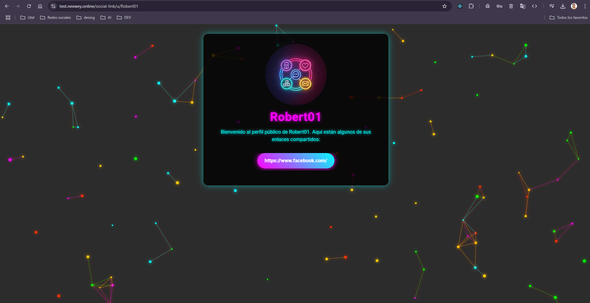

# Social Link Project

## Descripción General
El **Proyecto Social Link** es una aplicación web full-stack que permite a los usuarios gestionar y compartir sus enlaces de redes sociales a través de un panel de control personalizado. Los usuarios pueden registrarse, iniciar sesión, personalizar sus perfiles, subir imágenes de perfil y agregar/editar sus enlaces de redes sociales. El frontend está construido con React y Vite, mientras que el backend utiliza Node.js, Express y MySQL.

## Características Principales
- **Autenticación de Usuarios**: Registro e inicio de sesión seguro con autenticación basada en JWT.
- **Gestión de Perfiles**: Los usuarios pueden actualizar su información de perfil, incluidos temas e imágenes de perfil.
- **Gestión de Enlaces de Redes Sociales**: Agregar, editar y eliminar enlaces de redes sociales.
- **Perfiles Públicos**: Perfiles públicos compartibles que muestran los enlaces de redes sociales del usuario.
- **Diseño Responsivo**: Diseño adaptable para dispositivos móviles utilizando componentes de Material-UI.

## Tecnologías Utilizadas

### Frontend
- **React**: Biblioteca de JavaScript para construir interfaces de usuario.
- **Vite**: Herramienta de construcción rápida y servidor de desarrollo.
- **Material-UI (MUI)**: Framework de UI de React para componentes preconstruidos.
- **Framer Motion**: Biblioteca de animaciones para transiciones suaves.
- **Axios**: Cliente HTTP para realizar solicitudes API.
- **Emotion**: Biblioteca CSS-in-JS para estilizar.

### Backend
- **Node.js & Express**: Framework del lado del servidor.
- **MySQL**: Base de datos relacional para almacenar datos de usuario.
- **Sequelize**: ORM para interactuar con la base de datos.
- **JWT**: JSON Web Tokens para autenticación.
- **Multer**: Middleware para manejar cargas de archivos.
- **Cors**: Middleware para habilitar el uso compartido de recursos entre orígenes (CORS).

## Instalación y Configuración

### Requisitos Previos
- **Node.js** (v18 o superior)
- **npm** o **yarn**
- **MySQL** instalado y en ejecución
- **Git** (opcional, para clonar el repositorio)

### Pasos para Ejecutar Localmente

1. **Clona el Repositorio**:
   ```bash
   git clone https://github.com/RobertoPantojaL/social-links.git
   cd social-link-project
   ```

2. **Configura la Base de Datos**:
   - Asegúrate de que MySQL esté en ejecución y crea una base de datos llamada `social_link_db`.
   - Actualiza el archivo `.env` con tus credenciales de la base de datos.

3. **Configura el Backend**:
   - Navega al directorio `social-link-project`:
     ```bash
     cd social-link-project
     ```
   - Instala las dependencias:
     ```bash
     npm install
     ```
   - Crea un archivo `.env` en la raíz del directorio `social-link-project` con el siguiente contenido:
     ```env
     DB_HOST=localhost
     DB_USER=root
     DB_NAME=social_link_db
     DB_Password=your_password
     JWT_SECRET=your_jwt_secret
     PORT=5000
     FRONTEND_URL=http://localhost:3000
     ```
   - Inicia el servidor:
     ```bash
     npm start
     ```

4. **Configura el Frontend**:
   - Navega al directorio `client`:
     ```bash
     cd client
     ```
   - Instala las dependencias:
     ```bash
     npm install
     ```
   - Inicia el servidor de desarrollo:
     ```bash
     npm run dev
     ```

5. **Accede a la Aplicación**:
   - Abre tu navegador y navega a `http://localhost:3000` para acceder al frontend.
   - El backend estará disponible en `http://localhost:5000`.

## Estructura de Carpetas
```
social-link-project/
├── client/                # Aplicación React del frontend
│   ├── src/
│   │   ├── components/    # Componentes reutilizables de React
│   │   ├── App.jsx        # Componente principal de la aplicación
│   │   └── main.jsx       # Punto de entrada para la aplicación React
│   ├── package.json       # Dependencias del frontend
│   └── vite.config.js     # Configuración de Vite
├── social-link-project/   # Aplicación Node.js del backend
│   ├── server.js          # Archivo principal del servidor
│   ├── package.json       # Dependencias del backend
│   └── .env               # Variables de entorno
└── README.md              # Este archivo
```

## Endpoints de la API

### Autenticación
- **POST /api/register**: Registrar un nuevo usuario.
- **POST /api/login**: Iniciar sesión de un usuario existente.

### Gestión de Perfiles
- **GET /api/profile**: Obtener el perfil del usuario autenticado.
- **PUT /api/profile-image**: Subir/actualizar la imagen de perfil del usuario.
- **PUT /api/theme**: Actualizar las preferencias de tema del usuario.

### Enlaces de Redes Sociales
- **GET /api/links**: Obtener los enlaces de redes sociales del usuario autenticado.
- **PUT /api/links**: Actualizar los enlaces de redes sociales del usuario.

### Perfiles Públicos
- **GET /u/:username**: Obtener el perfil público y los enlaces de un usuario.

## Vista Previa y Demo en Línea

### Vista Previa
Puedes explorar cómo se ve la aplicación antes de instalarla localmente. La interfaz de usuario es limpia y moderna, diseñada para ser intuitiva tanto para usuarios novatos como avanzados. Algunas capturas de pantalla clave incluyen:
- **Página de Inicio de Sesión**: Un formulario minimalista donde los usuarios pueden iniciar sesión con su correo electrónico y contraseña.

- **Panel de Control**: Una vez que los usuarios inician sesión, pueden ver y gestionar sus enlaces de redes sociales, actualizar su imagen de perfil y personalizar el tema.

- **Perfil Público**: Los usuarios pueden compartir su perfil público con otros, mostrando todos sus enlaces de redes sociales en una página visualmente atractiva.


### Demo en Línea
Si deseas probar la aplicación sin configurarla localmente, puedes acceder a la **demo en línea** alojada en la siguiente URL:
- **Frontend**: [https://test.nexwey.online/social-link/](https://test.nexwey.online/social-link/)
- **Backend**: [https://social-link-api.onrender.com/](https://social-link-api.onrender.com/) *(Nota: Si estás utilizando la demo en línea, el backend estará configurado automáticamente).*

> **Nota**: La demo en línea puede tener limitaciones en comparación con la versión local, como restricciones en la creación de cuentas o la carga de imágenes debido a que el backend se encuentra en [Render](https://render.com/).

## Contribuciones
¡Las contribuciones son bienvenidas! Por favor, sigue estos pasos:
1. Haz un fork del repositorio.
2. Crea una nueva rama (`git checkout -b feature/YourFeatureName`).
3. Haz commit de tus cambios (`git commit -m 'Añadir alguna característica'`).
4. Sube a la rama (`git push origin feature/YourFeatureName`).
5. Abre una solicitud de pull.

## Licencia
Este proyecto está bajo la licencia **ISC**.
